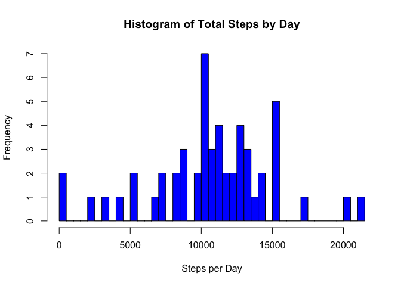
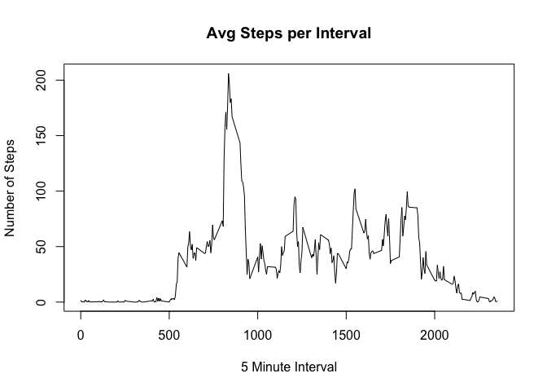
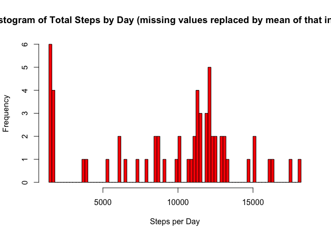
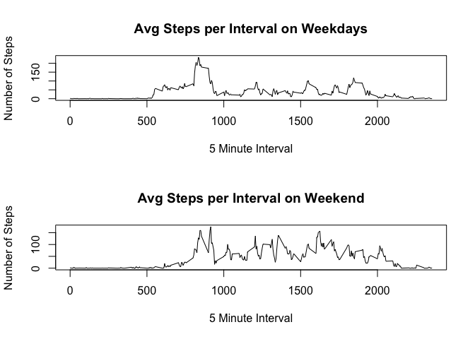

# Reproducible Research: Peer Assessment 1


## Loading and preprocessing the data
First let's load the data.

```r
unzip("./activity.zip")
activity_df <-  read.csv("./activity.csv")
```
I'm not going to perform any preprocessing of the data set after it is read into a dataframe.

## What is mean total number of steps taken per day?
Calculate the total number of steps taken per day:


```r
activity_date_df <- aggregate(steps~date, data = activity_df, FUN=sum)
```
This creates a dataframe of total steps taken per day we can use for further analysis.

Make a histogram of the total number of steps taken each day:

```r
hist(activity_date_df$steps,breaks = (length((activity_date_df$date))), col = "blue", xlab = "Steps per Day", main = "Histogram of Total Steps by Day")
```



Calculate and report the mean and median of the total number of steps taken per day:

```r
meansteps <- mean(activity_date_df$steps)
mediansteps <- median(activity_date_df$steps)
```
Mean steps : 1.0766189\times 10^{4}
Median steps : 10765
## What is the average daily activity pattern?
This creates a dataframe containing the average number of steps per 5 minute interval:

```r
activity_average_df<-aggregate(steps ~ interval, data = activity_df, FUN = mean)
```

Make a time series plot of the 5-minute interval and the average number of steps taken, averaged across all days:


```r
plot(activity_average_df$interval, activity_average_df$steps, type = "l", xlab = "5 Minute Interval", ylab= "Number of Steps", main = "Avg Steps per Interval")
```




```r
maxinterval <- activity_average_df$interval[which.max(activity_average_df$steps)]
```
Interval with the hightest average step count: Interval 835
## Imputing missing values
Calculate and report the total number of missing values in the dataset:

```r
sum(is.na(activity_df))
```

```
## [1] 2304
```
Devise a strategy for filling in all of the missing values in the dataset:

I plan on filling in the NA values with the mean steps for that particular interval. That should provide generally accurate counts.


```r
imputed_activity_df <- merge(activity_df, activity_average_df, by = "interval", suffixes=c("",".mean"))
NAs <- is.na(activity_df$steps)
imputed_activity_df$steps[NAs]<-imputed_activity_df$steps.mean[NAs]
imputed_activity_df <- imputed_activity_df[,c(1:3)]
```
Make a histogram of the total number of steps taken each day and Calculate and report the mean and median total number of steps taken per day:

```r
imputed_activity_date_df <- aggregate(steps~date, data = imputed_activity_df, FUN=sum)
hist(imputed_activity_date_df$steps,breaks = (length((imputed_activity_date_df$date))), col = "red", xlab = "Steps per Day", main = "Histogram of Total Steps by Day (missing values replaced by mean of that interval)")
```



```r
imputed_meansteps <- mean(imputed_activity_date_df$steps)
imputed_mediansteps <- median(imputed_activity_date_df$steps)
```
Do these values differ from the estimates from the first part of the assignment:

```r
mean_difference <- meansteps - imputed_meansteps
median_difference <- mediansteps - imputed_mediansteps
```
What is the impact of imputing missing data on the estimates of the total daily number of steps?
The mean steps with imputed data is roughly 13 percent lower than the unimputed mean. The imputed median is about 4 percent lower than the unimputed median.

## Are there differences in activity patterns between weekdays and weekends?
Create a new factor variable in the dataset with two levels – “weekday” and “weekend” indicating whether a given date is a weekday or weekend day:


```r
weekdays<-c("Monday","Tuesday","Wednesday","Thursday","Friday")
imputed_activity_df$weekday <- as.factor(ifelse(is.element(weekdays(as.Date(imputed_activity_df$date)),weekdays), "Weekday", "Weekend"))
```

Make a panel plot containing a time series plot of the 5-minute interval and the average number of steps taken, averaged across all weekday days or weekend days:


```r
weekday_activity_average_df<-aggregate(steps ~ interval, data = imputed_activity_df[imputed_activity_df$weekday == "Weekday",], FUN = mean)
weekend_activity_average_df<-aggregate(steps ~ interval, data = imputed_activity_df[imputed_activity_df$weekday == "Weekend",], FUN = mean)

par(mfrow=c(2,1))
plot(weekday_activity_average_df$interval, weekday_activity_average_df$steps, type = "l", xlab = "5 Minute Interval", ylab= "Number of Steps", main = "Avg Steps per Interval on Weekdays")
plot(weekend_activity_average_df$interval, weekend_activity_average_df$steps, type = "l", xlab = "5 Minute Interval", ylab= "Number of Steps", main = "Avg Steps per Interval on Weekend")
```


